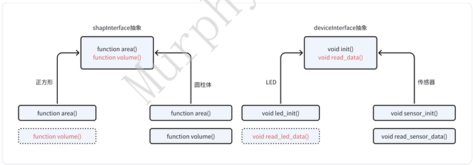
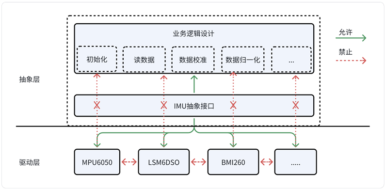

## 4.3-solid设计原则

&emsp;&emsp;solid设计是⾯向对象的原则，是由GangofFour（四⼈帮），即ErichGamma ,RichardHelm , Ralph Johnson&JohnVlissides四⼈）的《设计模式》（1995年出版）是第⼀次将设计模式提升到 理论⾼度，并将之规范化。  

<!-- 这是一张图片，ocr 内容为： -->


&emsp;&emsp;这些原则属于建议性原则，⼤家在做架构设计的时候要从实际的业务⻆度出发，切记不要为了设计⽽设计（冗余设计）。  

### 4.3.1 单⼀职责原则 
⼀个类只负责⼀件事情。价值：⾼内聚，低耦合，拓展性和健壮性强。  

```cpp
 #include <stdio.h>

 class Game {
 public:
    DataCompute();
    ~DataCompute();

    void setShapen();
    void setPlace();

    void showViewCcon(); //游戏⽅块显⽰
 
 private:
    int mPlace[4];         //位置     
    int mShape[4];         //形状

    DataCompute *mDataCompute;    //游戏逻辑
    int mStartButton;             //开始按钮
    int mEndButton;               //结束按钮
};

```

```cpp
 #include <stdio.h>
 
//游戏逻辑
class DataCompute {
public:
    DataCompute();
    ~DataCompute();

    void setShapen();
    void setPlace();
private:
    int mPlace[4];       //位置
    int mShape[4];       //形状   
};
 
class GameUI
{
public:
    GameUI();
    ~GameUI();

    void showViewCcon();         //游戏⽅块显⽰   
private:
    DataCompute *mDataCompute;       //游戏逻辑 
    int mStartButton;                //开始按钮
    int mEndButton;                  //结束按钮
};

```

在C语⾔中，就是⼀个结构体在设计和封装的时候只负责⼀个事情。以⼀个imu器件的驱动结构体为例  

```c
struct imu_operations {
    int (*init)(struct int_param_s *int_param);
    int (*set_bypass)(unsigned char bypass_on);
    int (*enable_sensor)(unsigned char sensors);
    int (*configure_fifo)(unsigned char sensors);
    int (*set_sample_rate)(unsigned short rate);
    int (*set_mag_sample_rate)(unsigned short rate);
    int (*get_sample_rate)(unsigned short *rate);
    int (*set_gyro_fsr)(unsigned short fsr);
    int (*set_accel_fsr)(unsigned char fsr);
    int (*get_gyro_fsr)(unsigned short *fsr);
    int (*get_accel_fsr)(unsigned char *fsr);

    int (*get_compass_fsr)(unsigned short *fsr);
    int (*get_gyro_sens)(float *sens);
    int (*get_mag_sens)(float *sens);
    int (*get_accel_sens)(unsigned short *sens);
    int (*read_gyro_data)(short *data, unsigned long *timestamp);
    int (*read_accel_data)(short *data, unsigned long *timestamp);
    int (*read_mag_data)(short *data, unsigned long *timestamp);
};

struct imu_chip {
    struct imu_operations *ops;

    struct imu_data accel_data[CALI_DATA_LEN];
    struct imu_data gyro_data[CALI_DATA_LEN];
    struct imu_data compass_data[CALI_DATA_LEN];

    ...
};
```

`struct imu_data compass_data[CALI_DATA_LEN]`; struct+名字+{}不是这样吗？

🔴 1. 你说的这种写法是“定义结构体类型”

你说的：

```c
struct 名字 {
    ...
    };
```

👉 这是在 **定义一个结构体类型**

例如：

```c
struct imu_data {
    int x;
    int y;
    int z;
};
```

👉 这一步只是告诉编译器：

“以后有一种类型叫 `struct imu_data`”

⚠️ 注意：  
👉 **这里只是定义类型，还没有变量！**


🟢 2. 你代码里的写法是“声明变量”

你问的这句：

```c
struct imu_data compass_data[CALI_DATA_LEN];
```

👉 这是在干嘛？

✅ 声明一个变量（而且是数组变量）

拆开看：

```c
struct imu_data   // 类型
    compass_data      // 变量名
    [CALI_DATA_LEN]   // 数组
```

定义了一个数组，里面有 CALI_DATA_LEN 个 imu_data 结构体

🧠 3. 举个具体例子

假设：

```plain
#define CALI_DATA_LEN 3
```

那这句：

```plain
struct imu_data compass_data[CALI_DATA_LEN];
```

等价于：

```plain
struct imu_data compass_data[3];
```

内存里就是：

```plain
compass_data[0]  → struct imu_data
compass_data[1]  → struct imu_data
compass_data[2]  → struct imu_data
```

<font style="color:#DF2A3F;">一句话总结（一定要记住）</font>

`struct xxx {}` 是“定义类型”  
`struct xxx 变量名` 是“定义变量”  
`struct xxx 变量名[N]` 是“定义结构体数组”

###  4.3.2 开闭原则
&emsp;&emsp;软件中的对象（类、模块、函数等）应该满⾜对于拓展是开放的，对修改是封闭的。体会⼀下模块化编程的例⼦：  

```c
// Keil STM32 方案：模拟 Linux module_init 机制

/* module_init.h */

#ifndef __MODULE_INIT_H__
#define __MODULE_INIT_H__

typedef void (*init_t)(void);

#define module_init(fn)                                      \
    const init_t __embedi_##fn                               \
    __attribute__((section("embedi_init")))                  \
    __attribute__((used)) = fn

#endif

/* module_init.c */

#include "module_init.h"

extern int embedi_init$$Base;
extern int embedi_init$$Length;

void embedi_module_init(void)
{
    init_t *init_call = (init_t *)&embedi_init$$Base;
    int count = 0;

    count = (int)(&embedi_init$$Length) / sizeof(init_t);

    while (count--) {
        (*init_call)();
        init_call++;
    }

    osLog("module init \n");
}
```
把各个模块的初始化函数自动收集起来，然后统一调用  

先看这个 typedef

```plain
typedef void (*init_t)(void);
```

👉 定义了一个函数指针类型：

```plain
init_t = 指向 void func(void) 的函数指针
```

例如：

```plain
void f(void) {}

init_t p = f;
```

最关键的宏：`module_init(fn)`

```plain
#define module_init(fn) \
const init_t __embedi_##fn __attribute__((section("embedi_init"))) \
__attribute__((used)) = fn
```

这个是核心中的核心🔥

🔍 展开后长什么样？

比如你写：

```plain
module_init(module_one_init);
```

👉 实际变成：

```plain
const init_t __embedi_module_one_init 
__attribute__((section("embedi_init"))) 
__attribute__((used)) 
= module_one_init;
```


🧠 这句话在干嘛？

👉 做了三件事：


① 定义一个函数指针变量

```plain
const init_t __embedi_module_one_init = module_one_init;
```

👉 存的是函数地址


② 放到指定段（section）

```plain
__attribute__((section("embedi_init")))
```

👉 把这个变量放到：

```plain
embedi_init 段
```

③ 防止被优化掉

```plain
__attribute__((used))
```

👉 即使没用到，也保留

🔵  多个文件一起注册（关键思想）

你看：

```plain
// 1.c
module_init(module_one_init);

// 2.c
module_init(module_two_init);
```

👉 每个 `.c` 文件都会生成一个变量：

```plain
embedi_init 段里变成：
[ &module_one_init ]
[ &module_two_init ]
[ &module_xxx_init ]
...
```


🔥 重点

👉 所有 `.c` 文件的这些变量：

**最终会被链接器拼在一起，放到一块连续内存**


统一调用：`embedi_module_init`

```plain
extern int embedi_init$$Base;
extern int embedi_init$$Length;
```

👉 这两个是 **链接器提供的符号**

📌 它们代表什么？

| 符号 | 含义 |
| --- | --- |
| `embedi_init$$Base` | 段起始地址 |
| `embedi_init$$Length` | 段长度 |


🔍 核心代码

```c
init_t* init_call = (init_t*)&embedi_init$$Base;
int count = 0;

count = (int)(&embedi_init$$Length) / sizeof(init_t);

while (count--) {
    (*init_call)();
    init_call++;
}
```

执行过程（超级重要）

假设内存中：

```plain
embedi_init 段：

0x1000 → &module_one_init
0x1004 → &module_two_init
0x1008 → &module_three_init
```

第一步

```plain
init_call = 0x1000
```

第二步

```plain
count = 3
```

第三步（循环）

```plain
(*init_call)(); → module_one_init()
init_call++

(*init_call)(); → module_two_init()
init_call++

(*init_call)(); → module_three_init()
```

内存结构（你必须理解这个🔥）

```plain
+-----------------------+
| embedi_init 段        |
+-----------------------+
| &module_one_init      |
| &module_two_init      |
| &module_three_init    |
+-----------------------+
```

👉 这是一个：

**函数指针数组（自动生成的）**

为什么这么设计？

传统写法：

```plain
module_one_init();
module_two_init();
module_three_init();
```

👉 问题：

+  要手动维护 
+  增加模块要改主函数 

用这个机制：

```plain
module_init(xxx);
```

👉 优点：

✅ 自动注册  
✅ 不用改主流程  
✅ 模块解耦  
✅ 可扩展性强

本质是什么（面试级总结）

这段代码实现的是：

**利用“链接器段（section）”把函数指针收集成数组，然后统一遍历调用**

和你前面学的知识连接

✅ 1. 函数指针

```plain
(*init_call)();
```

✅ 2. 数组

```plain
init_call++
```

👉 本质是数组遍历

✅ 3. 指针运算

```plain
sizeof(init_t)
```

✅ 4. 内存布局

👉 连续存储

✅ 5. 编译 + 链接

👉 不只是 C 语法，还涉及：

+  section 
+  链接器 
+  段合并 

这个机制在哪些地方用？

你以后会经常看到：

Linux 内核

```plain
module_init(...)
```

 RTOS

```plain
INIT_COMPONENT_EXPORT(...)
```

驱动框架

```plain
DEVICE_INIT(...)
```

**常见坑**

❗1. 没加 `used`

👉 会被优化掉

❗2. section 名字写错

👉 链接不到一起

❗3. 没有链接脚本支持

👉 `$$Base` / `$$Length` 无效

❗4. 函数签名不一致

👉 调用崩溃

✅**最后一行总结（必须记住）**

这段代码通过 `section` 把各模块的初始化函数“自动收集成数组”，再通过指针遍历统一调用，实现模块解耦和自动初始化机制。

```c
// GCC 方案

#include <stdio.h>

typedef void (*init_t)(void);

#define module_init(fn)                                      \
    const init_t __embedi_##fn                               \
    __attribute__((section(".embedi_init")))                 \
    __attribute__((used)) = fn

extern init_t __init_start;
extern init_t __init_end;

void embedi_module_init(void)
{
    init_t *init_call = (init_t *)&__init_start;

    for (; init_call < &__init_end; init_call++) {
        (*init_call)();
    }
}

static void module_one_init(void)
{
    printf("%s call \n", __FUNCTION__);
}

module_init(module_one_init);

static void module_two_init(void)
{
    printf("%s call \n", __FUNCTION__);
}

module_init(module_two_init);

/* 1.lds */

__init_start = .;

.embedi_init : {
    *(.embedi_init)
}

__init_end = .;

//gcc -o bin 1.c -T 1.lds
```

1.lds是用来干嘛的？

链接脚本（Linker Script），用来告诉链接器：程序在内存里怎么排布。

**这两个本质上是同一套思路，都是：**

**把初始化函数指针放到一个专门的 section 里，再统一遍历调用。**

区别主要在于：**依赖的编译器/链接器不同，所以拿 section 边界的方式不同。**

你可以这样理解：


第二张是 **GCC 方案**，第一张是 **Keil/ARMCC 方案**。

**GCC 方案的特点**

它自己在 `1.lds` 里写了链接脚本：

```plain
__init_start = .;
.embedi_init : { *(.embedi_init) }
__init_end = .;
```

意思是：

+  把所有 `.embedi_init` 段内容放一起 
+  记住开始地址 `__init_start`
+  记住结束地址 `__init_end`

所以代码里这样遍历：

```plain
init_t* init_call = (init_t*)&__init_start;
for (; init_call < &__init_end; init_call++) {
    (*init_call)();
}
```

也就是：**通过“起始地址 + 结束地址”来遍历。**

**Keil 方案的特点**

Keil 这边没有用你自己写的 `.lds`，而是用了它工具链自动提供的 section 符号：

```plain
extern int embedi_init$$Base;
extern int embedi_init$$Length;
```

这里表示：

+ `embedi_init$$Base`：section 起始地址 
+ `embedi_init$$Length`：section 总长度 

所以它不是拿“开始和结束”比较，而是先算出有多少个函数指针：

```plain
count = (int)(&embedi_init$$Length) / sizeof(init_t);
```

再循环调用：

```plain
while (count--) {
    (*init_call)();
    init_call++;
}
```

也就是：**通过“起始地址 + 总长度”来遍历。**

### 4.3.3 ⾥⽒替换原则 
&emsp;&emsp;⾥⽒替换原则：简单来讲就是⼦类可以去拓展⽗类的功能，但不能改变⽗类原有的功能。技术上，所有引⽤基类的地⽅必须能够透明的使⽤其⼦类的对象。价值：继承⼀定程度上破坏了封装，此原则⽤来包含封装性。但嵌⼊式中应⽤相对较少，可以感受⼀下下⾯这个例⼦：  

```cpp
#include <iostream>
using namespace std;

// 基类
class birds {
protected:
    int flySpeed;
    int runSpeed;

public:
    void setFlySpeed(int s) {
        flySpeed = s;
    }

    void setRunSpeed(int s) {
        runSpeed = s;
    }

    int getFlySpeed(void) {
        return flySpeed;
    }

    int getRunSpeed(void) {
        return runSpeed;
    }

    int calculateFlyTime(int distance) {
        return distance / flySpeed;
    }
};

// 派生类：燕子
class swallow : public birds {
};

// 派生类：鸵鸟
class ostrich : public birds {
public:
    void setFlySpeed(int s) {
        flySpeed = 0;
    }
};

int main(void)
{
    birds *b1 = new swallow;
    birds *b2 = new ostrich;

    int distance = 100;

    b1->setFlySpeed(10);
    cout << "b1 flySpeed: " << b1->getFlySpeed() << endl;
    cout << "b1 flyTime: " << b1->calculateFlyTime(distance) << endl;

    b2->setFlySpeed(0);
    cout << "b2 flySpeed: " << b2->getFlySpeed() << endl;
    cout << "b2 flyTime: " << b2->calculateFlyTime(distance) << endl;

    delete b1;
    delete b2;

    return 0;
}
```

**继承只是“能不能用”，LSP是“用了会不会炸”**

| **概念** | **本质** |
| --- | --- |
| **继承** | **代码复用 / 类型关系** |
| **里氏替换原则** | **子类能不能“安全替换父类”** |


```cpp
#include <iostream>
using namespace std;

// 基类：动物
class animal {
protected:
    int runSpeed;

public:
    void setRunSpeed(int s) {
        runSpeed = s;
    }

    int getRunSpeed(void) {
        return runSpeed;
    }
};

// 鸟类：继承自动物
class birds : public animal {
protected:
    int flySpeed;

public:
    void setFlySpeed(int s) {
        flySpeed = s;
    }

    int getFlySpeed(void) {
        return flySpeed;
    }

    int calculateFlyTime(int distance) {
        return distance / flySpeed;
    }
};

// 派生类：燕子，会飞，所以继承 birds
class swallow : public birds {
};

// 派生类：鸵鸟，不会飞，所以直接继承 animal
class ostrich : public animal {
};
```

```c
class swallow : public animal, public Flyable { };
```

```c
#include <stdio.h>
#include <string.h>

struct birds {
    int flySpeed;
    int runSpeed;

    void (*setFlySpeed)(struct birds *b, int s);
    void (*setRunSpeed)(struct birds *b, int s);

    int (*getFlySpeed)(struct birds *b);
    int (*getRunSpeed)(struct birds *b);

    int (*calculateFlyTime)(struct birds *b, int distance);
};

void setFlySpeed(struct birds *b, int s)
{
    b->flySpeed = s;
}

void setRunSpeed(struct birds *b, int s)
{
    b->runSpeed = s;
}

int getFlySpeed(struct birds *b)
{
    return b->flySpeed;
}

int getRunSpeed(struct birds *b)
{
    return b->runSpeed;
}

int calculateFlyTime(struct birds *b, int distance)
{
    return distance / b->flySpeed;
}

/* 派生类：燕子 */
struct swallow {
    struct birds b;
};

/* 派生类：鸵鸟 */
struct ostrich {
    struct birds b;
};

struct swallow s = {
    .b.setFlySpeed = setFlySpeed,
    .b.setRunSpeed = setRunSpeed,
    .b.getFlySpeed = getFlySpeed,
    .b.getRunSpeed = getRunSpeed,
    .b.calculateFlyTime = calculateFlyTime,
};

struct ostrich o = {
    .b.setFlySpeed = setFlySpeed,
    .b.setRunSpeed = setRunSpeed,
    .b.getFlySpeed = getFlySpeed,
    .b.getRunSpeed = getRunSpeed,
    .b.calculateFlyTime = calculateFlyTime,
};

int main(void)
{
    struct birds *b1 = (struct birds *)&s;
    struct birds *b2 = (struct birds *)&o;

    int distance = 100;

    b1->setFlySpeed(b1, 10);
    printf("b1 flySpeed: %d\n", b1->getFlySpeed(b1));
    printf("b1 flyTime: %d\n", b1->calculateFlyTime(b1, distance));

    b2->setFlySpeed(b2, 0);
    printf("b2 flySpeed: %d\n", b2->getFlySpeed(b2));
    printf("b2 flyTime: %d\n", b2->calculateFlyTime(b2, distance));

    return 0;
}
```

子类必须能够完全替换父类使用，而程序行为不出问题。

###  4.3.4 接⼝隔离原则  
定义：不应该强迫⽤⼾端实现⼀个它⽤不上的接⼝。具体两个的例⼦：  

 1. 抽象了⾯积和体积的两个接⼝，客⼾端在使⽤的这个接⼝的时候会发现，对于正⽅形来说没有体积，所以实现体积的函数对它来说就是冗余的。  

 2. 抽象了器件初始化和读取数据的接⼝。对于LED灯来说，⼀般都是控制型，没有必要实现⼀个读 LED数据的接⼝，所以对LED来说，读取数据就是冗余的。  



###  4.3.5 依赖倒置原则  
&emsp;&emsp;⾼层次模块不应该依赖低层次的模块，实际上是⾯向抽象编程思想，这样可以降低代码间的耦合度，使其看扩展、易维护。举⼀个驱动的例⼦：在这个架构设计中，IMU有很多公共的业务逻辑：初始化、读取数据、数据校准等等，这些业务逻辑不应该耦合具体驱动的接⼝，⽽是依赖于抽象接⼝；同时驱动与驱动之间也不能互相调⽤，⽽是调⽤抽象接⼝。后续的器件增加拓展，只需要修改驱动部分，抽象层都不会改动。  



你写代码像点外卖：

+  ❌ 错误：你指定“必须是某家厨师做的” 
+  ✅ 正确：你只说“我要一份宫保鸡丁” 

👉 谁做的不重要，只要符合接口（能做菜）