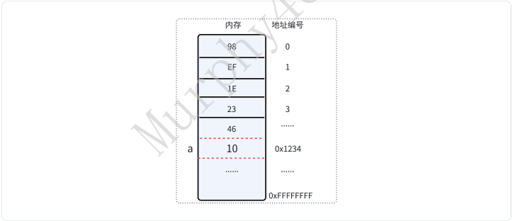
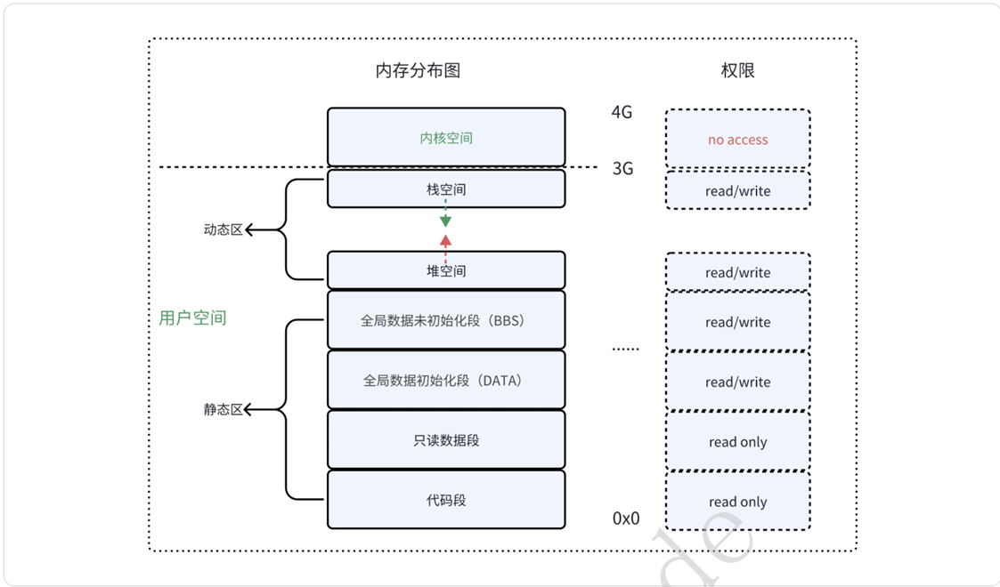
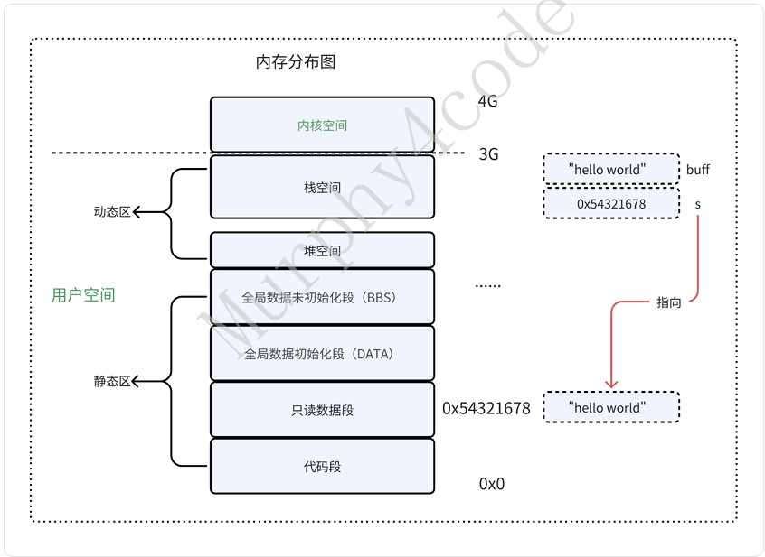

# 五、内存视⻆

## 5.1-内存基础概念

&emsp;&emsp;前⾯在学习数据类型关键字的时候我们了解到，定义⼀个变量的本质是在内存中圈定⼀块特定⼤ ⼩的内存。本章将会对内存的位置、⽣命周期、操作权限等做更多的探讨。  



### 5.1.1 内存空间分布图 
&emsp;&emsp;内存分布分成静态区和动态区，静态区在编译时已经决定了内存分配⼤⼩，动态区是运⾏时分配。  



```c
#include <stdio.h>

int global_inited = 10;   // 全局初始化变量
int global_uninited;      // 全局未初始化变量

int main(void)
{
    int local_var = 20;               // 局部变量
    char *str = "Hello";              // 字符串常量
    static int static_var = 30;       // 静态变量
    int *heap_var = (int *)malloc(sizeof(int));  // 动态分配的内存

    printf("address of code: %p\n", main);
    printf("address of str: %p\n", str);
    printf("address of global_inited : %p\n", (void *)&global_inited);
    printf("address of static_var: %p\n", (void *)&static_var);
    printf("address of global_uninited: %p\n", (void *)&global_uninited);
    printf("address of heap_var : %p\n", (void *)heap_var);
    printf("address of local_var : %p\n", (void *)&local_var);

    // 释放动态分配的内存
    free(heap_var);

    return 0;
}

// 运行结果:
// address of code: 0x55e737e1f1a9
// address of str: 0x55e737e20008
// address of global_inited : 0x55e737e22010
// address of static_var: 0x55e737e22014
// address of global_uninited: 0x55e737e2201c
// address of heap_var : 0x55e738cb12a0
// address of local_var : 0x7ffe44b03c14
```

####  5.1.1.1 代码段  
&emsp;&emsp;代码段只能读不可以写，写会触发Segmentationfault(coredumped)，俗称"段错误"。在整个程序⽣命周期内合法有效。  

```c
 #include <stdio.h>

 void func(void)
 {
    printf("hello func \n");
 }

 int main(void)
 {
    printf("func addr %p \n", func);

    void (*p)(void) = func;
    //try to access
    p();
    int *p1 = (int *)func;
    //try to read
    printf("func addr %d \n", *p1);
    //try to write
    *p1 = 1;
    return 0;
 }
//运⾏结果：
 
func addr 0x561398e14169 
hello func 
func addr -98693133 
Segmentation fault (core dumped)
```

`*p1`是解引用都嘛，p1是指针，不应该是`p1= (int *)func`？

`void (*p)(void) =func`; // 函数指针  
`int*p1= (int*)func; `// 普通指针

**`int*p1= (int*)func;`**

强行把“函数地址”当成“int地址”  

####  5.1.1.2 只读数据段  
&emsp;&emsp;只读数据段存放字符传常量，地址⽐代码段更⾼。权限是：只能读不可以写，写会触发 Segmentation fault (core dumped)，在整个程序⽣命周期内合法有效。  

```c
 #include <stdio.h>
 
 int main(void)
 {
    printf("%s read only data addr: %p \n", "hello world", "hello world");
    char *s = "hallo world";
    s[1] = 'e';//try to write rodata Segmentation 
    return 0;
 }
//运⾏结果：
 
read only data addr: 0x56014766f008 
Segmentation fault (core dumped)
```

**`char *s`和`char s`的区别**

① 写法一：指针

```plain
char *s = "hello";
```

👉 本质：

+ `s` 是一个指针变量 
+  指向 `"hello"` 这个字符串常量 

👉 内存：

```plain
.rodata（只读区）:  "hello"
                 ↑
                 s（指针，存在栈里）
```

👉 特点：

+  ❌ 不能改内容 
+  ✅ 可以改指向 

```plain
s = "world";   // ✅ 可以
s[0] = 'H';    // ❌ 崩溃
```

---

② 写法二：数组

```plain
char s[] = "hello";
```

👉 本质：

+ `s` 是一个数组 
+  把 `"hello"`**拷贝一份到栈上**

👉 内存：

```plain
栈：
s → ['h','e','l','l','o','\0']
```

👉 特点：

+  ✅ 可以改内容 
+  ❌ 不能改整体指向 

```plain
s[0] = 'H';   // ✅ 可以
s = "world";  // ❌ 不行（数组名不能赋值）
```

####  5.1.1.3 全局数据段  
&emsp;&emsp;全局变量和局部static修饰的变量会放在**全局数据段**（data/bbs），允许读写，在整个程序⽣命周期内合法有效。  

```c
 #include <stdio.h>

 int a = 10;
 int b;

 int func(void)
 {
    static int d = 10;
    b++;
    return ++d;
 }

 int main(void)
 {
    static int c;
    printf("%p , %p, %p \n", &a, &b, &c);
    //try to write data Segmentation
    a = 20;
    b = 30;
    c = 40;
    printf("a = %d , b = %d, c = %d \n", a, b, c);

    printf("b = %d , d = %d, d = %d\n", b, func(), func());
    return 0;
 }
//运⾏结果：
0x5556e9e9b010 , 0x5556e9e9b020, 0x5556e9e9b01c 
a = 20 , b = 30, c = 40 
b = 32 , d = 12, d = 11
```

这段代码说明：

+ `a、b、c、d` 都属于静态存储期变量 
+  未初始化的全局/静态变量默认是 0 
+ `static` 局部变量只初始化一次，后面会一直保存值 
+ `printf` 里多个 `func()` 同时出现时，参数求值顺序不确定，所以会出现 `12, 11`

####  5.1.1.4 堆空间  
&emsp;&emsp;堆空间在运⾏时由程序员来分配（malloc）和释放（free），可读可写，⽣命周期是程序员来决定。值得注意的是，如果在⼀个函数中分配堆内存，函数执⾏结束后malloc空间不会被释放，如果不⼿动进⾏释放的话，会造成内存泄漏。  

```c
 #include <stdio.h>
 #include <stdlib.h>

 void func(void)
 {
    int *heap_var = (int *)malloc(sizeof(int)); // 动态分配的内存，单位是B，默认反馈的类型是void* 
    if (!heap_var) {
        return;
    }
    //try to write heap Segmentation
    *heap_var = 10;
    printf("heap addr = %p , heap_var = %d\n", heap_var, *heap_var);
 }

 int main(void)
 {
    func();
    return 0;
 }
 free(heap_var);//如果没有free动作，heap_var指向的内存就存在泄漏：不会再使⽤但⼜不能分配给别⼈
 
//运⾏结果：
heap addr = 0x55bf2b8db2a0 , heap_var = 10
```

####  5.1.1.5 栈空间  
&emsp;&emsp;栈空间指的是在函数运⾏时的上下⽂分配的空间，可读可写，⽣命周期在函数执⾏结束后结束。 看下⾯的⼀个例⼦：buff和s都是局部变量，系统会给buff分配sizeof("helloworld")栈空间，⽽s的栈空间是4byte，它指向只读数据段中的字符串"helloworld"地址编号。所以这⾥返回buff就会有问题， 返回指针没有问题。  

```c
 #include <stdio.h>

 char* func(void)
 {
    char *s = "hello world";
    char buff[] = "hello world";

    printf("func:%s \n", buff);
    return s;
 }
 void main(void)
 {
    char *p = func();
    printf("main:%s \n", p);
 }
```



❗ 为什么“返回 buff 会有问题”

如果你这样写：

```plain
return buff;   // ❌
```

👉 问题在这里：

+ `buff` 在栈上 
+ `func()` 一结束 
+  栈空间被释放 

👉 你返回的是：

**一个已经失效的地址（野指针）**

---

❗  为什么“返回 s 没问题”

```plain
return s;   // ✅
```

👉 因为：

+ `s` 指向的是 `.rodata`
+ `.rodata` 是**全局存在的（程序整个生命周期都在）**

👉 所以：

返回的是“长期有效的地址”

**堆栈的⽣⻓⽅向问题：** 

```c
#include <stdio.h>
#include <stdlib.h>

void func(int *a)
{
    int *p1 = (int *)malloc(sizeof(int));
    int *p2 = (int *)malloc(sizeof(int));

    if (p2 > p1) {
        printf("heap upward \n");
    } else {
        printf("heap downward \n");
    }

    free(p1);
    free(p2);

    int a = 1;
    int b = 2;

    if (&b > a) {
        printf("stack upward \n");
    } else {
        printf("stack downward \n");
    }
}

int main(void)
{
    int a;

    func(&a);

    return 0;
}
```

&a

👉 一般内存布局（从低到高）：

```plain
低地址
↓
代码区（text）
数据区（data / bss）
堆（向上 ↑）
……
栈（向下 ↓）
高地址
```

👉 设计成这样是为了：

+  堆和栈“对着长” 
+  最大化利用内存空间

**总结一句话**

👉 堆：通常向高地址增长  
👉 栈：通常向低地址增长

###  5.1.2 内存溢出问题 
&emsp;&emsp;内存溢出指的是程序运⾏过程中，访问超过其分配空间范围的内存区域。  

####  5.1.2.1 栈溢出  
&emsp;&emsp;递归函数：递归函数如果没有正常的退出条件，最后会把整个栈空间消耗殆尽，最后出现段错误。  

```c
#include <stdio.h>

void try_overflow(void)
{
    int a = 10;
    try_overflow();
}

void main(void)
{
    try_overflow();
}

// 运行结果:
// Segmentation fault (core dumped)

// 汇编
// try_overflow:
// .LFB0:
//     endbr64
//     pushq   %rbp
//     movq    %rsp, %rbp
//     subq    $16, %rsp    // 分配栈空间的内存
//     movl    $10, -4(%rbp)
//     call    try_overflow // 反复调用
//     nop
//     leave
//     ret
```

很⼤的局部变量  

```c
#include <stdio.h>
#include <string.h>

#define N 8192*1024

void main(void)
{
    char arr[N];

    memset(arr, 'c', sizeof(char)*N);

    for (int i = 0; i < N; i++) {
        printf("%c", arr[i]);
    }

    puts("");
}

// 运行结果:
// Segmentation fault (core dumped)

// 查看栈大小限制：
// murphy@ubuntu:/home/workspace/course$ ulimit -a
// core file size          (blocks, -c) 0
// data seg size           (kbytes, -d) unlimited
// scheduling priority             (-e) 0
// file size               (blocks, -f) unlimited
// pending signals                 (-i) 15152
// max locked memory       (kbytes, -l) 65536
// max memory size         (kbytes, -m) unlimited
// open files                      (-n) 1024
// pipe size            (512 bytes, -p) 8
// POSIX message queues     (bytes, -q) 819200
// real-time priority              (-r) 0
// stack size              (kbytes, -s) 8192
// cpu time               (seconds, -t) unlimited
// max user processes              (-u) 15152
// virtual memory          (kbytes, -v) unlimited
// file locks                      (-x) unlimited
```

👉 栈空间很小（几MB）  
👉 你一次性开了 8MB → 直接爆栈 → 崩溃  

栈缓冲区溢出  

```c
#include <stdio.h>
#include <string.h>

#define N 10

void main(void)
{
    char arr[N];
    char arr1[] = "hello world";

    strcpy(arr, arr1); // 工程上建议不要用 strcpy，用 strncpy
    // strncpy(arr, arr1, N);

    printf("arr:%s \n", arr);
    printf("arr1:%s \n", arr1);
}

// strcpy运行结果
// arr:hello world
// arr1:d

// strncpy运行结果
// arr:hello worlhello world // 原因是arr长度不够，copy N个字符串中缺少结束符'\0'
// arr1:hello world
```

**arr为10，为啥能:hello worlhello world这么多  ？**

 从 arr 开始 → 一直往后读 → 直到遇到 '\0'  

####  5.1.2.2 堆缓冲区溢出  
```c
 #include <stdio.h>
 #include <string.h>
 #include <stdlib.h>

 #define N 5
 void main(void)
 {
    char *str = (char*)malloc(sizeof(char)*N);
    char *str1 = (char*)malloc(sizeof(char)*N);

    strcpy(str1, "hello world");
    strcpy(str, "hello world");

    printf("str:%s \n",str);
    printf("str1:%s \n",str1);
 }
//运⾏结果：溢出没有显⽰出异常，但已经污染了堆的其他区域
str:hello world 
str1:hello world 
```

你在改“别人的地盘”，只是暂时没人发现