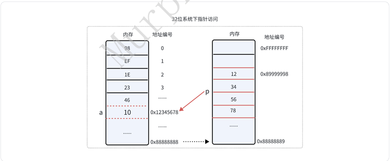
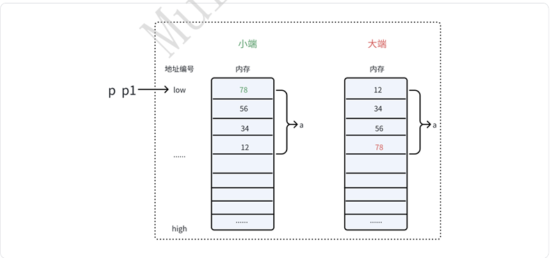
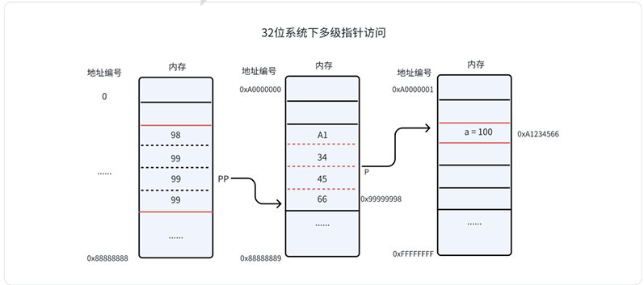
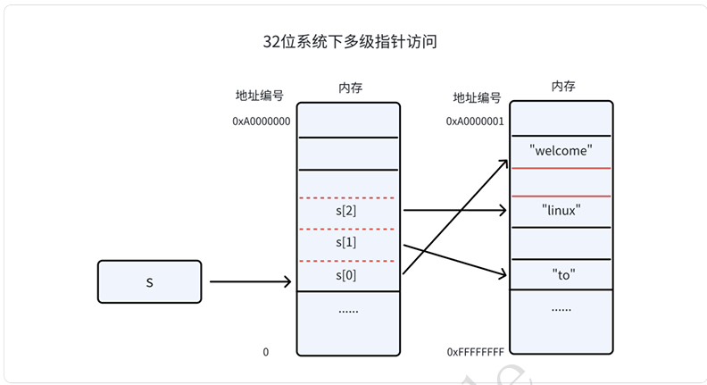

## 5.2-指针

&emsp;&emsp;前⾯在介绍指针类型时，已经知道指针变量圈定的内存⼤⼩**<font style="color:#DF2A3F;">跟编译器有关或者说跟CPU的地址总线有关</font>**。在32位的系统中，指针类型占⽤4byte，在64位的系统中，指针类型占⽤8byte。指针变量的值有特殊意义，代表了⼀个地址编号，本章讲重点讲指针访问内存的规则和技巧。另外，希望⼤家对这两个概念：指针和指针变量，有清晰的区分。我们⼀般说指针，代表就是这个**指针变量的值**，即内存地址；指针变量就是⼀个**变量**，⽤于存放内存地址。  

`inta=10;`

 a 在内存地址：`0x1000`

 `0x1000` 就是“指针”（地址）  

`int*p=&a;`

+ `p` 是变量（存在内存里） 
+  里面存的是地址 `0x1000`



###  5.2.1 指针访问内存  
&emsp;&emsp;要访问指针指向的地址，那就必然需要回答两个问题：1、内存的可读可写性是什么？2、内存的访问规则是什么？  

####  5.2.1.1 指针变量的初始化  
&emsp;&emsp;⼤家要养成思维习惯：每当看到⼀个指针变量，要对其值的合法性保持敬畏。  

```c
 #include <stdio.h>
 #include <stdlib.h>

 int b = 20;

 void main(void)
 {
    int a = 10;
    int *p1 = &a;
    int *p2 = &b;
    int *p3 = (int*)malloc(sizeof(int));
    if (!p3) {
        return;
    }
    
    *p3 = 30;
    int *p;
    p = (int *)100;//从复制语法上可⾏，但内存不可读，不可写
    
    free(p3);
    
    printf("*p1 = %d, *p2 = %d, *p3 = %d \n", *p1, *(&b), p3[0]);
    printf("p = %p \n", p);
    printf("*p = %d \n", *p);
 }
 //运⾏结果：
 *p1 = 10, *p2 = 20, *p3 = 30 
 p = 0x64 
 Segmentation fault (core dumped)
```

####  5.2.1.2 空指针和野指针  
&emsp;&emsp;空指针很好理解，就是值为0（NULL）的指针变量，如果访问了0地址就会出现⾮法访问的错误。 野指针是指值为⾮法地址的指针变量。野指针在实际⼯程中有很⼤的危害，会造成代码的稳定问题 （不可预知的bug）。要形成free后，把指针变量置空（NULL）的习惯。  

```c
 #include <stdio.h>
 #include <string.h>
 #include <stdlib.h>

 void main(void)
 {
    int *ptr = NULL;
    printf(" *p = %d \n", *ptr);

    ptr = (int*)malloc(sizeof(int));
    *ptr = 102;
    printf(" *p = %d \n", *ptr);
    
    free(ptr);
 }
\\运行结果通常是：
Segmentation fault (core dumped)
\\如果把错误的空指针解引用删掉，程序才会正常输出：
*p = 102
 ```

```c
 #include <stdio.h>
 #include <string.h>
 #include <stdlib.h>

 void main(void)
 {
    int *ptr = (int*)malloc(sizeof(int));
    printf(" *ptr = %d \n", *ptr);
    free(ptr);
    //ptr = NULL;
    if (NULL != ptr) {
        *ptr = 102;
    }

    int *p = (int*)malloc(sizeof(int));
    printf(" *p = %d \n", *p);
    printf(" ptr = %p \n", ptr);
    printf("   p = %p \n", p);
    //*ptr = 101;
 }
//运⾏结果：
 
*ptr = 0
*p = 102 //指针执⾏的内容被别的指针（ptr）修改了
 
ptr = 0x55bf1f2cc2a0 //ptr就是野指针，指向的这块内存已经不属于它，但是它仍可以⾮法访问
p = 0x55bf1f2cc2a0  
```

步骤1：malloc → ptr 指向 A  
步骤2：free(ptr) → A 被释放  
步骤3：*ptr = 102 → 你偷偷改了 A（非法）  
步骤4：malloc → p 又拿到了 A

 👉 `free` 只是“归还内存”，不是“清空指针”  
👉 不置 NULL → 就变成野指针 → 可能污染新分配的内存  

####  5.2.1.3 指针访问内存的规则 
&emsp;&emsp;我们前⾯学过⼏种指针访问内存的⽅式：`*p`、`p[x]`、`p->x`。那每次访问的⼤⼩是多少呢？我们知道指针变量的定义的形式是：数据类型*p；所以每次访问的⼤⼩由前⾯修饰的数据类型决定。  

#####  5.2.1.3.1 标准数据类型指针  
```c
 #include <stdio.h>
 void main(void)
 {
    int a = 0x12345678;

    int *p = &a;
    char *p1 = (char*)&a;

    printf(" *p  = 0x%x \n", *p);
    printf(" *p1 = 0x%x \n", *p1);
    
    printf(" p1[0] = 0x%x \n", p1[0]);
    printf(" p1[1] = 0x%x \n", p1[1]);
    printf(" p1[2] = 0x%x \n", p1[2]);
    printf(" p1[3] = 0x%x \n", p1[3]);
 }
//运⾏结果
*p  = 0x12345678 
*p1 = 0x78 
p1[0] = 0x78 
p1[1] = 0x56 
p1[2] = 0x34 
p1[3] = 0x12 
Tips：
1、记住，不管⼤端还是⼩端，指针p和p1都是指向低地址。
```



👉 **小端：低位字节放低地址**  
👉 **大端：高位字节放低地址**

```plain
int a = 0x12345678;
```

👉 拆成字节是：

```plain
0x12  0x34  0x56  0x78
↑高位            低位↑
```

#####  5.2.1.3.2 连续空间类型指针  
```c
 #include <stdio.h>

 struct abc {
    int a;
    int b;
    char c;
 };

 int arr[3] = {1,2,3};

 int main(void)
    {
    struct abc data = {
        .a = 1,
        .b = 2,
        .c = 3,
    };

    printf(" size of struct abc = %ld\n", sizeof(struct abc));

    struct abc *p = &data;
    printf(" a = %d, b = %d, c = %d\n", p->a, p->b, p->c);

    int* p1 = (int *)&data;
    printf(" struct p1[0] = %d \n", p1[0]);
    printf(" struct p1[1] = %d \n", p1[1]);
    printf(" struct p1[2] = %d \n", p1[2]);

    int* p2 = arr;
    printf(" arr p2[0] = %d \n", p2[0]);
    printf(" arr p2[1] = %d \n", p2[1]);
    printf(" arr p2[2] = %d \n", p2[2]);  
    return 0;
 }
//运⾏结果：
size of struct abc = 12
a = 1, b = 2, c = 3
struct p1[0] = 1
struct p1[1] = 2
struct p1[2] = 3
arr p2[0] = 1
arr p2[1] = 2
arr p2[2] = 3
```

```c
#include <stdio.h>

// Linux container_of 宏的思想
#define offsetof(TYPE, MEMBER) ((size_t)&((TYPE *)0)->MEMBER)

#define container_of(ptr, type, member) ({              \
    const typeof(((type *)0)->member) *__mptr = (ptr);  \
    (type *)((char *)__mptr - offsetof(type, member));  \
})

struct abc {
    int a;
    int b;
    char c;
};

void find_struct(int *member)
{
    unsigned long offset = 0;
    struct abc *p = NULL;

    offset = (unsigned long)&((struct abc *)0)->b;
    printf(" member offset: %ld \n", offset);

    p = (struct abc *)((char *)member - offset);

    printf(" a:%d, b:%d c: %d \n", p->a, p->b, p->c);
}

int main(void)
{
    struct abc data = {
        .a = 1,
        .b = 2,
        .c = 3,
    };

    printf(" size of struct abc = %ld\n", sizeof(struct abc));

    struct abc *p = &data;
    printf(" a = %d, b = %d, c = %d\n", p->a, p->b, p->c);

    find_struct(&data.b);

    return 0;
}
```

```plain
(struct abc*)0
```

👉 把 **地址 0** 强行当成一个结构体

```plain
((struct abc*)0)->b
```

👉 相当于：

从地址 0 出发，找到 b 的位置

再取地址

```plain
&(...)
```

👉 得到的就是：

```plain
b 的“地址” = 偏移量
```

**1.先看 **`->`** 的本质**

```plain
p->b
```

等价于：

```plain
*(p).b
```

再展开：

```plain
*( (char*)p + 偏移量 )
```

**2.代入 p = 0**

```plain
((struct abc*)0)->b
```

等价于：

```plain
*( (char*)0 + 偏移量 )
```

**3.加上**`&`

```plain
&((struct abc*)0)->b
```

👉 就变成：

```plain
(char*)0 + 偏移量
```

关键来了

```plain
0 + 偏移量 = 偏移量
```

👉 所以结果就是一个数字！

#####  5.2.1.3.3 函数类型指针  
```c
 #include <stdio.h>
 #include <stdlib.h>
 #include <string.h>

 int (*show)(const char *, ...);
 void func(void)
 {
    show = printf;
    show("func call \n");
 }

 int main(void)
 {
    func();
    return 0;
 }

tips: 函数指针结合typedef来⽤，代码更容易读懂：
typedef void(*func)(void);
func call;//定义⼀个指针变量
call();//调⽤
```

#####  5.2.1.3.4 指针修改const变量  
```c
 #include <stdio.h>

 int main(void)
 {
    int a = 0x12345678;
    const int b = 0x11111111;
    
    int *p = &a;
    p[1] = 0x22222222;//越界访问
    
    printf("a = 0x%x, b = 0x%x \n",a , b);
    return 0;
 }

//运⾏结果：编译连警告都没有
a = 0x12345678, b = 0x22222222
```

 👉 注意：**a 和 b 在栈上通常是挨着的**（具体顺序不保证，但很多编译器是这样）  

###  5.2.2 指针运算  
####  5.2.2.1 指针+、-、++、--运算  
&emsp;&emsp;指针变量本质也是⼀个变量，所以进⾏算数运算语法上是可以的。但是实际的⼯程应⽤中，指针 变量的乘除法没有意义，更多的是加减法。总的来说，+运算符⽤于指针的算术运算，允许将指针移动到任意偏移位置，⽽++运算符是+运算符的特例，它递增指针指向的位置，移动⼀个对象的⼤⼩。看 ⼀个例⼦：  

```c
 #include <stdio.h>

 int main(void)
 {
    int array[] = {1, 2, 3, 4, 5};
    int *p = array;

    p = p + 2;//p[2]
    printf("*p = %d \n", *p);

    p++;//p[3]
    printf("*p = %d \n", *p);

    return 0;
 }

//运⾏结果
*p = 3 
*p = 4
```

####  5.2.2.2 指针逻辑运算  
&emsp;&emsp;逻辑运算中，判断两个指针是否相等⽐较常⽤，其他的不常⽤。另外，只有两个相同类型的指针⽐较才有意义，⼀般编译也会包警告，如果类型不同。  

```c
#include <stdio.h>
#include <stdlib.h>

int main(void)
{
    int *p = (int *)malloc(sizeof(int));

    if (p == NULL) {
        return -1;
    }

    char *p1 = NULL;

    if (p1 == p) { // warning
        // do something
    }

    free(p);

    return 0;
}

// 运行结果
// 1.c: In function ‘main’:
// 1.c:12:12: warning: comparison of distinct pointer types lacks a cast
//    12 |     if (p1 == p) {
//       |
```

```c
#define MAX(x, y) ({              \
    typeof(x) _max1 = (x);        \
    typeof(y) _max2 = (y);        \
    (void) (&_max1 == &_max2);    \
    _max1 > _max2 ? _max1 : _max2;\
})
```

1️⃣ 只计算一次（避免副作用）

```plain
typeof(x) _max1 = (x);
typeof(y) _max2 = (y);
```

👉 把 x、y 先存起来  
✔ 防止 `i++` 被执行两次

2️⃣ 类型检查

```plain
(void) (&_max1 == &_max2);
```

👉 强制编译器检查类型  
✔ 防止 `int` 和 `float` 混用

3️⃣ 返回最大值

```plain
_max1 > _max2 ? _max1 : _max2;
```

👉 就是普通的三目运算

###  5.2.3 多级指针  
&emsp;&emsp;多级指针本质上也是⼀个指针，也需要⼀个指针变量来存放。这个指针变量的内存⼤⼩跟⼀级指针⼀样，跟系统有关。  

```c
int **p

1. *p 第⼀"*" 决定变量p 是⼀个指针变量
2. **p 第⼆"*" 决定指针p 访问内存规则是以指针类型进⾏访问，所以
*p的值还是⼀个指针(地址)
3. int 决定指针(*p) 访问内存规则是以int类型进⾏访问，所以*(*p) 是int类型
```



```c
 #include <stdio.h>
 #include <stdlib.h>
 int main(void)
 {
    int a = 100;
    int *p = &a;
    int **pp = &p;
    
    printf("**pp = %d, *pp[0] = %d \n",**pp, *pp[0]);
    printf("size of pp %ld \n", sizeof(pp));
    return 0;
 }

 //运⾏结果
**pp = 100, *pp[0] = 100 //建议⽤*pp[]的⽅式访问
size of pp 8  
```

```c
#include <stdio.h>

int main(void)
{
    char a = 's';
    char *p = &a;
    char **pp = &p;

    printf("a = %c\n", a);
    printf("*p = %c\n", *p);
    printf("**pp = %c\n", **pp);

    return 0;
}
```

⽤于指针变量地址传递  

```c
 #include <stdio.h>
 #include <stdlib.h>

 void func1(char * s)
 {
    printf("func1: %s \n", s);

    s = "hello linux";
 }

 void func2(char **s)
 {
    *s = "hello linux";
 }

 int main(void)
 {
 char * s = "hello world";
 func1(s);
 printf("s1 = %s \n", s);
 func2(&s);
 printf("s2 = %s \n", s);
 return 0;
 }
//运⾏结果
 
func1: hello world 
s1 = hello world //
s2 = hello linux
```

`s1 = hello world`//进入 func1 后，形参 s 是一个新的局部变量，它和 main 里的 s 不是同一个变量。
但是重点是：传进去的是“地址的副本”，不是 main 里那个指针变量 s 本身。
```
main 里的 s
func1 里的 s
```
它们的值一开始都一样，都指向 "hello world"。

C语言函数传参是值传递。

```void func1(char *s)```

这里的 s 是一个 char * 指针，它保存的是字符串首字符的地址。

如果在函数里写：

`*s = "hello linux";`

这是不对的。

原因是：
```
s 的类型是 char *
*s 的类型是 char
```
也就是说，*s 代表的是 s 指向的第一个字符。

例如：

`char *s = "hello world";`

那么：

*s 就是字符 'h'

所以：

`*s = "hello linux";`

相当于把一个字符串地址赋值给一个 char 字符，类型不匹配。

正确理解：

*s 只能修改一个字符，例如：

`*s = 'H';`

但是不能写：

`*s = "hello linux";`

因为 "hello linux" 是字符串，类型是 char *。

另外，如果 main 里这样定义：

`char *s = "hello world";`

这个字符串是字符串常量，一般不能修改它的内容。

所以即使写：

`*s = 'H';`

也可能导致程序崩溃。

如果想修改字符串内容，应该用字符数组：
```c
#include <stdio.h>

void func1(char *s)
{
    printf("func1: %s\n", s);

    s[0] = 'H';
}

int main(void)
{
    char s[] = "hello world";

    func1(s);

    printf("s = %s\n", s);

    return 0;
}

输出结果：

func1: hello world
s = Hello world
```
总结：

`char *s = "hello world";`

表示 s 指向字符串常量，不建议修改内容。

`char s[] = "hello world";`

表示定义了一个字符数组，数组里的内容可以修改。

如果只是想修改字符串中的某个字符，可以用数组：

`s[0] = 'H';`

如果想让 main 里的指针 s 改为指向另一个字符串，要用二级指针。

 **<font style="color:#DF2A3F;">多级指针⽤于物理⽆序映射到逻辑有序的数据结构设计：</font>**  

```c
 #include <stdio.h>
 #include <stdlib.h>

 int main(void)
 {
    char *arr[3] = {"welcome", "to", "linux"};
    char **s = arr;

    printf("%s:%p\n",s[0], s[0]);
    printf("%s:%p\n",s[1], s[1]);
    printf("%s:%p\n",s[2], s[3]);

    printf("&s[0]:%p\n",&s[0]);
    printf("&s[1]:%p\n",&s[1]);
    printf("&s[2]:%p\n",&s[2]);

    return 0;
 }
 
//运⾏结果
 welcome:0x5557a265a004
 to:0x5557a265a00c
 linux:0x75e4a3ccff45c900
 &s[0]:0x7ffd01eaeb80
 &s[1]:0x7ffd01eaeb88
 &s[2]:0x7ffd01eaeb90
```

char *arr[3] = {"welcome", "to", "linux"}; 

char arr[3] = {"welcome", "to", "linux"};的区别  ？

 一个是“指针数组”，一个是“字符数组”  。

`char arr[3] = {"welcome", "to", "linux"};`
是错误写法。因为 char arr[3] 表示只有 3 个 char 字符空间：
```
arr[0]
arr[1]
arr[2]
```
它只能放 3 个字符，不能放 3 个字符串。
如果你想存 3 个字符串，并且希望每个字符串内容可以修改，应该用二维字符数组：
```
char arr[3][10] = {"welcome", "to", "linux"};
```

| 表达式       | 等价        | 结果    | 含义           |
| --------- | --------- | ----- | ------------ |
| `**s`     | `*(*s)`   | `'w'` | 第一个字符串的第一个字符 |
| `*s[1]`   | `*(s[1])` | `'t'` | 第二个字符串的第一个字符 |
| `(*s)[1]` |           | `'e'` | 第一个字符串的第二个字符 |




 `arr`   等价于：  `&arr[0]` 类型是：  `char**`  
`char**s=&arr[0];`  
`s→&arr[0]`

```c
arr[0] -> "welcome"  
arr[1] -> "to"
arr[2] -> "linux"
```

| 表达式    | 含义          |
| ------ | ----------- |
| `s`    | 指向 `arr[0]` |
| `s[0]` | `arr[0]`    |
| `s[1]` | `arr[1]`    |
| `*s`   | `arr[0]`    |
| `**s`  | `'w'`       |

| 元素       | 里面存的内容           |
| -------- | ---------------- |
| `arr[0]` | `"welcome"` 的首地址 |
| `arr[1]` | `"to"` 的首地址      |
| `arr[2]` | `"linux"` 的首地址   |


`arr = 0x1000`  
`&arr = 0x1000`  
`&arr[0] = 0x1000`

arr（数组，在栈上） 地址：0x1000
```
+----------------+----------------+----------------+
| arr[0]         | arr[1]         | arr[2]         |
| 0x2000         | 0x3000         | 0x4000         |
+----------------+----------------+----------------+
```
字符串（常量区）
0x2000 -> "welcome\0"
0x3000 -> "to\0"
0x4000 -> "linux\0"

**关键点：**`"welcome"`**是什么？**

👉 `"welcome"` 本质是：

**一个字符串常量，其值是“首字符的地址”**

所以：

```plain
arr[0] = "welcome";
```

👉 实际就是：

```plain
arr[0] = 0x2000;   // 假设地址
```