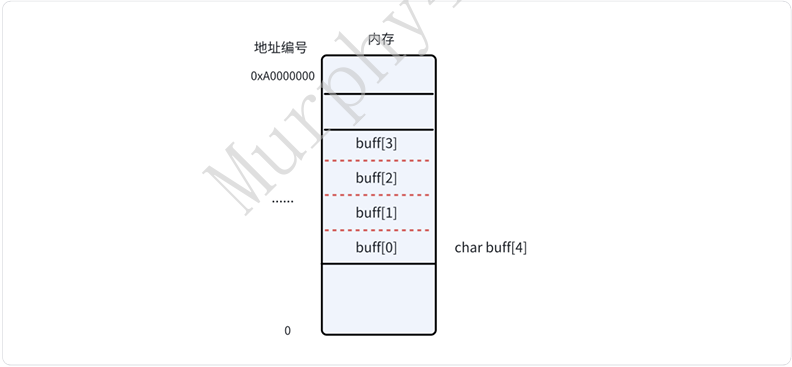
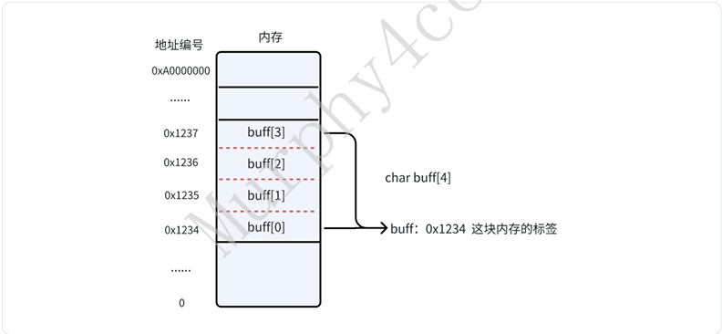
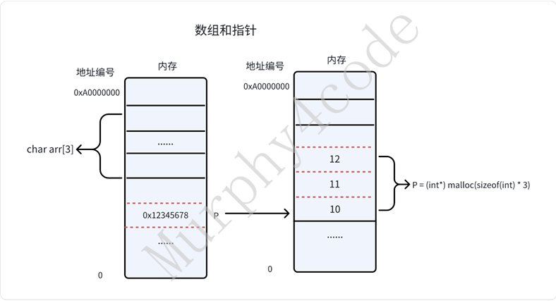
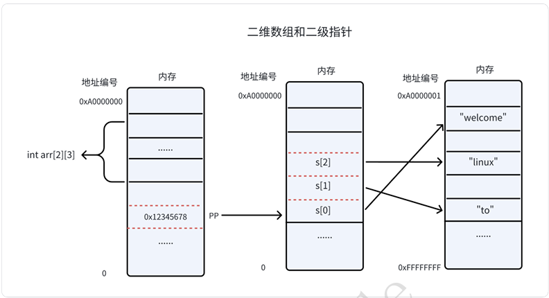

&emsp;&emsp;数组本质上不算是⼀个新的数据类型，⽽是⼀种⽤于存储相同类型数据元素的数据结构。数组中的每个元素都有唯⼀的索引（位置），通过索引可以访问和操作数组中的元素。  



###  5.3.1 数组的定义  
&emsp;&emsp;数组定义需要回答：分配多少空间？读取的⽅式是什么？  

&emsp;&emsp;指针变量会真正占内存；数组名本身一般不单独占内存，它只是编译器用来表示这块数组空间的名字。

```
数组名不单独占内存；
数组本身占内存；
指针变量占内存；
数组名只是编译器给数组这块内存起的名字。
```

```c
数据类型 数组名[n] ：int array[10]
tips: n
的作⽤域是在申请空间的时候⽣效，代表圈定了n*sizeof(数据类型)字节的空间

 #include <stdio.h>
 int main(void)
 {
    int arr[5] = {1,2,3,4,5};
    printf("size of arr is: %ld byte,len is %ld \n", sizeof(arr),
        sizeof(arr) / sizeof(arr[0]));

    return 0;
 }
//运⾏结果：
size of arr is: 20 byte,len is 5
```

####  5.3.1.1 数组名的本质  
&emsp;&emsp;数组名是⼀个常量标签（类似函数名），所以数组名不能做左值，是圈定的内存的别名。数组名的值是**地址常量（指针常量）**，是⼀个地址编号，指向数组的⾸元素。  



数组名是常量标签  

```c
#include <stdio.h>
#include <stdlib.h>

int main(void)
{
    char arr[20];

    arr = "hello wolrd"; // 编译报错

    return 0;
}

// 编译结果
// 1.c: In function ‘main’:
// 1.c:7:9: error: assignment to expression with array type
//     7 |     arr = "hello wolrd";
//       |
//
// 原因：
// arr 是数组名，不是普通指针变量。
// 数组名代表数组首元素地址，但它不是一个可以被重新赋值的变量。
// 所以不能写：
//
// arr = "hello wolrd";
//
// 可以这样写：
//
// char arr[20] = "hello wolrd";
//
// 或者：
//
// strcpy(arr, "hello wolrd");
//
// Tips:
// 啥是指针常量？
// 假设 0x12345678 合法，则：
//
// (int *)0x12345678
//
// 就是一个指针常量。
// 指针常量当然不能被赋值：
//
// (int *)0x12345678 = 123; // 不符合语法
//
// 类似：
//
// (int)123 = 456; // 也不符合语法
```

 ❗让 arr 指向 `"hello world"` 的地址  

 arr 和&arr的区别  

&emsp;&emsp;arr的值和&arr值⼀样，但是意义不同：arr的值是指向数组的⾸元素的地址常量（指针常量）， &arr的值是指向整⽚数组内存的地址常量（指针常量）。所以都是指针常量，但是指针读取内存规则不⼀样。  

```c
 #include <stdio.h>
 #include <stdlib.h>

 char arr[12];

 int main(void)
 {
    printf("arr  = %d\n", arr);
    printf("&arr = %d\n", &arr);
    printf("size of arr is: %ld\n", sizeof(arr));
    printf("arr + 1  = %d\n", arr + 1);
    printf("&arr + 1 = %d\n", &arr + 1);

    return 0;
 }
//运⾏结果
arr     = 738533400 
&arr     = 738533400
size of arr is: 12
arr + 1  = 738533401
&arr + 1 = 738533412//&arr + 1 跳过的是 整个数组，也就是 12 字节。
```
arr是char*类型(首元素的地址)
&arr是char(*)[12]类型(整个数组的地址)

####  5.3.1.2 ⼀维数组的访问  
```c
 #include <stdio.h>
 #include <stdlib.h>

 int main(void)
 {
    char arr[12] = "hello world";

    printf("%c \n", arr[4]);
    printf("%c \n", *(arr+4));
    
    return 0;
 }
//运⾏结果 
o 
o
```

####  5.3.1.3 ⼆维数组的访问  
```c
 #include <stdio.h>
 int main()
 {
    int arr[3][5] = {{1, 2, 3, 4, 5}, {6, 7, 8, 9, 10}, {11, 12, 13, 14, 15}};

    // 打印数组指针指向的数组中的元素
    for (int i = 0; i < 3; i++) {
        for (int j = 0; j < 5; j++) {
            printf("%d ", arr[i][j]);
        }
        printf("\n");
    }

    printf("%p %p %d\n", arr, *arr, **arr);

    // 打印数组指针指向的数组中的元素
    for (int i = 0; i < 3; i++) {
        for (int j = 0; j < 5; j++) {
            printf("%d ", *(*(arr+i)+j));
        }
        printf("\n");
    }
    return 0;
 }
//运⾏结果
 
1 2 3 4 5 
6 7 8 9 10 
11 12 13 14 15 

0x7ffc6fb525d0 0x7ffc6fb525d0 
1 2 3 4 5 
6 7 8 9 10 
11 12 13 14 15 
```

###  5.3.2 数组与指针  
####  5.3.2.1 数组与指针区别  
&emsp;&emsp;数组和指针本质上都可以代表⼀个连续的空间。只是数组名是这段连续空间的标签（指针常量），⽽指针需要⼀个指针变量来存放。在访问内存时，数组名和指针可以画等号。  



####  5.3.2.2 指针数组与数组指针  
&emsp;&emsp;指针数组：**指针数组是⼀个数组，其中的每个元素都是⼀个指针**。  

&emsp;&emsp;⽰例：`int*array[3]`;声明了⼀个包含3个元素的指针数组，每个元素都是⼀个指向整数的指针。  

&emsp;&emsp;⽤途：指针数组常⽤于存储⼀组指针，每个指针可以指向不同类型的数据或不同位置的数组。  

```c
 int main() 
 {
    int a = 1, b = 2, c = 3;
    int *array[3] = {&a, &b, &c};
    // 打印指针数组中每个元素指向的值
    
    for (int i = 0; i < 3; i++) {
        printf("%d ", *array[i]);
    }
    return 0;
 }
```
数组指针：**数组指针是⼀个指针，它指向⼀个数组** 

⽰例：`int(*ptr)[3]`; 声明了⼀个指针，指向包含3个元素的整数数组  

⽤途：数组指针常⽤于处理⼆维数组或作为指向动态分配数组的指针  

```c
 #include <stdio.h>
 int main()
 {
    int arr[3][5] = {{1, 2, 3, 4, 5}, {6, 7, 8, 9, 10}, {11, 12, 13, 14, 15}};

    int (*p)[5] = arr;
    // 打印数组指针指向的数组中的元素
    for (int i = 0; i < 3; i++) {
        for (int j = 0; j < 5; j++) {
            printf("%d ", p[i][j]);
        }
    printf("\n");
    }
    return 0;
 }
```

####  5.3.2.3 ⼆维数组和⼆级指针的关系  
&emsp;&emsp;先说结论：没有关系。⼆维数组本质上是⼀段连续空间的圈定，跟⼆级指针在概念上就不是⼀个维度，⽆法⽐较。但⼆维数组名是⼀个 **⼆级指针常量。在内存访问时，⼆维数组名和⼆级指针可以画等号**。  


