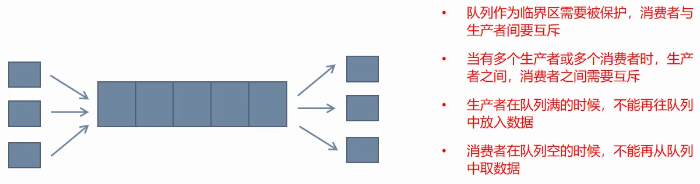

## 生产者消费者队列
&emsp;&emsp;它是实现线程间协作，交互一种重要手段。从一端放数据，从另一端取数据。放入数据的线程称为生产者，取出数据的线程称为消费者。生产者和消费者可以有一个或多个。



**按用途将队列划分为两大类：**

**1️⃣数据分发的队列**

&emsp;&emsp;队列中存放的业务数据。可以有一个或多个生产者，消费者线程。生产者线程产生不同类型的数据，通过队列分发给不同消费者线程

👉 队列里放的是：**业务数据**

🧠 理解：

+  生产者：负责“产生数据” 
+  消费者：负责“处理数据” 
+  队列：负责“中转 + 分发”

**2️⃣任务队列**

队列中存放的是可调用对象，可以有一个或多个生产者，消费者线程

 👉 队列里放的是：**可调用对象（函数 / lambda / bind）**

🧠 理解：

**不是传数据，而是传“要干的事情”**

1.在调用要求时序的情况下，应该只有一个生产者和一个消费者线程，一个队列，时序的要求由队列的先进先出的特性保证

2.在调用不要求时序的情况下，则可以有多个生产者，消费者线程

&emsp;&emsp;通过任务队列，来实现异步调用。发起业务操作的线程不会被阻塞，业务执行函数被放到另外一个线程执行，比如释放过程耗时高的资源且释放操作不能并发进行时。可以将释放操作专门放到一个线程中去做，此时可以有多个生产者线程，一个消费者线程，生产者将需要释放的资源对象放入队列，消费者线程依次取出后进行释放操作。此时就需要队列来实现异步操作

✅ 情况1：要求时序（顺序必须一致）

👉 必须：

+  1个生产者 
+  1个消费者 
+  1个队列 

为什么？

因为队列是 FIFO（先进先出）

👉 保证：

```plain
push顺序 == 执行顺序
```

❌ 情况2：不要求时序（可以乱序）

👉 可以：

+  多生产者 
+  多消费者 

特点：

+  更高性能（并发） 
+  但执行顺序不可控 

**根据队列中的容量划分**

有界队列

&emsp;&emsp;容量有大小限制，当满了后，生产者线程需要等待，为空的时候，消费者线程需要等待。这种队列可以用于数据分发的场景，但不能用于异步调用(异步调用的特性是生产者调用能马上返回，所以如果生产者阻塞在等待容器空闲显然是不满足要求的)

队列满了：

👉 生产者必须等待（阻塞）

```plain
push → 队列满 → 卡住等待
```

队列空了：

👉 消费者必须等待

```plain
pop → 队列空 → 卡住等待
```

无界队列

&emsp;&emsp;容量大小无限制，生产者线程可以一直放数据，队列为空的时候，消费者线程需要等待。这种队列即可以用于数据分发，也可以用于异步操作。这种情况下，消费者线程数量要大于生产者线程，是让数据或是任务及时被处理，避免堆积

生产者：

👉 永远不会阻塞

```plain
push → 永远成功 ✅
```

消费者：

👉 为空才等待

```plain
pop → 空 → 等待
```