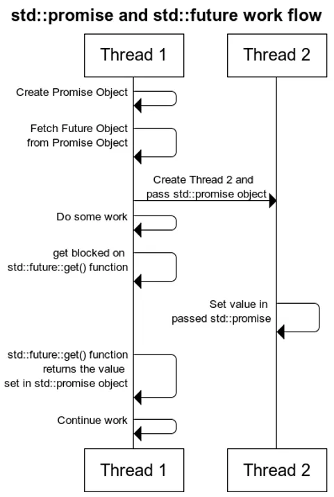

## thread库提供的更高层次的抽象
&emsp;&emsp;thread 库对OS 线程系列API的封装，可以非常方便地使用线程，互斥量，条件变量。但是直接使用thread库中的互斥量，条件变量来实现线程的同步或协作，还是属于底层的抽象，比如两个线程thread1,thread2间的协作，两个线程间共享一个变量，thread2需要等待thread1将变量设置成某一个值，才继续运行。此时需要用到互斥量，条件变量。其实，在实现思路是比较简单的，但是实现上还是比较复杂。

&emsp;&emsp;tread库提供了更高的抽象封装`std::future`,`std::promise`,`std::package_task`

## future 未来量
&emsp;&emsp;它提供了一种机制可以获取异步操作的结果，因为一个异步操作的结果不能马上获取，只能在未来某个时候从某个地方获取。这个异步操作的结果是一个未来的期待值，所以被称为future，可以称它为未来量。

`std::future` 通常结合`std::promise`,`std::package_task`,`std::async` 使用

`std::future`是一个类模版，模版参数需要传入一个类型

## promise 承诺量
&emsp;&emsp;称之为承诺量，它结合`std::future`一起使用(给予承诺，在未来某个时刻获取)。与futrue结合时相当与建立一个线程间的通道：一边往promise里放东西(set_value)，一边取去东西(通过futrue的get方法)。

`std::promise`也是一个类模版，模版参数需要传入一个类型。每个`std::promise`对象都关联了一个`std::future`对象。

## promise 与 future的用法 
使用 `std::promise`与 `std::future`给线程间建立一个通道，分为以下几步：

1. 在线程1中创建一个 `std::promise`对象

`std::promise<int> promiseObj;`

2. 在线程1中通过 `promiseObj.get_future()` 获得 `std::future` 对象

`std::future<int> futureObj = promiseObj.get_future();`

此时通道已经建立：

promiseObj 负责“写数据”

futureObj 负责“读数据”

3. 将 promiseObj 传给线程2

`std::thread t(threadFunc, std::move(promiseObj));`

注意：std::promise 不能拷贝，只能移动，所以要用 std::move。

4. 在线程1中调用 futureObj.get()

如果线程2还没有设置值，get() 会一直阻塞等待。

`int value = futureObj.get();`

5. 在线程2中给 promiseObj 设置一个值

`promiseObj.set_value(45);`

此时线程1中的 futureObj.get() 会解除阻塞，并拿到 45。

线程1：消费者（Consumer）  
线程2：生产者（Producer）

```cpp
#include <iostream>
#include <future>
#include <thread>
void thread1Func(std::promise<int> promiseObj)
{
    std::this_thread::sleep_for(std::chrono::seconds(1));
    promiseObj.set_value(18);
}

int main()
{
    std::promise<int> promiseObj;
    std::future<int> f = promiseObj.get_future();

    std::thread t1(thread1Func, std::move(promiseObj));

    std::cout << f.get() << std::endl;
    t1.join();
}
```

```plain
main线程：创建 promiseObj
main线程：通过 promiseObj.get_future() 得到 future f
main线程：把 promiseObj 移动给子线程 t1
子线程 t1：睡眠 1 秒
main线程：执行 f.get()，因为还没有值，所以阻塞等待
子线程 t1：promiseObj.set_value(18)
main线程：f.get() 解除阻塞，拿到 18 并输出
main线程：t1.join() 等待子线程结束
```

## 协作流程图


## future与shared_future
&emsp;&emsp;`std::funture` 只支持移动语义，它要求类型参数也支持移动语义。它的get方法只能调用一次，调用get相当于将结果移走(移动语义的通俗意义)。再次调用会抛异常。

&emsp;&emsp;`std::shared_future` 可以共享结果，可以多次调用get方法，它要求类型参数支持复制语义

✅ 1. `std::future` 示例（只能 get 一次）

```cpp
#include <iostream>
#include <future>
#include <thread>

int main()
{
    std::promise<int> p;
    std::future<int> f = p.get_future();

    std::thread t([&p]() {
        p.set_value(100);
    });

    // 第一次 get ✅
    std::cout << "first get: " << f.get() << std::endl;

    // 第二次 get ❌（会抛异常）
    try {
        std::cout << "second get: " << f.get() << std::endl;
    } catch (const std::exception& e) {
        std::cout << "exception: " << e.what() << std::endl;
    }

    t.join();
}
```

✔ 特点

+  只能 `get()` 一次 
+  第二次会抛异常（因为值已经被“拿走”了） 

✅ 2. `std::shared_future` 示例（可以 get 多次）

```cpp
#include <iostream>
#include <future>
#include <thread>

int main()
{
    std::promise<int> p;

    // future → shared_future
    std::shared_future<int> sf = p.get_future().share();

    std::thread t([&p]() {
        p.set_value(200);
    });

    // 可以多次 get ✅
    std::cout << "first get: " << sf.get() << std::endl;
    std::cout << "second get: " << sf.get() << std::endl;
    std::cout << "third get: " << sf.get() << std::endl;

    t.join();
}
```

## packaged_task
&emsp;&emsp;`std::packaged_task`代表一个异步调用task，它是个函数对象，可以像正常函数一样被执行。它封装一个可调用对象，传递给一个std::thread对象，在线程中执行。通过std::future来获得执行结果

```cpp
int PrintFunc(int v)
{
    std::this_thread::sleep_for(std::chrono::seconds(1));
    std::cout<<"v "<<v<<std::endl;
    return v;
}
```

上面的一个简单的函数，可以通过 std::package_task对它进行封装，来实现异步调用

```cpp
//包装PrintFunc
std::packaged_task<int (int)> task(PrintFunc);
//获取future
std::future<int> f = task.get_future();
//创建线程异步调用
std::thread thread2(std::move(task),18);
```

&emsp;&emsp;当然也可以通过```std::promise```结合```std::future```来实现，但是需要修改函数的声明，要把std::promise对象传入，与std::packeaged_task的实现，相当于是一种侵入式的实现，std::packaged_task实现的更加简明。

👉 它的作用就是：把一个普通函数，变成“可以异步拿结果的任务”

```cpp
#include <iostream>
#include <future>
#include <thread>

int PrintFunc(int v)
{
    std::this_thread::sleep_for(std::chrono::seconds(1));
    std::cout << "v = " << v << std::endl;
    return v;
}

int main()
{
    // 1. 包装函数
    std::packaged_task<int(int)> task(PrintFunc);

    // 2. 获取 future
    std::future<int> f = task.get_future();

    // 3. 放到线程中执行
    std::thread t(std::move(task), 18);

    // 4. 获取结果（会阻塞）
    std::cout << "result = " << f.get() << std::endl;

    t.join();
}
```

```plain
packaged_task 包装函数
        ↓
线程执行 task(...)
        ↓
返回值自动塞进 future
        ↓
f.get() 获取结果
```

❌ promise（侵入式）

你必须改函数：

```cpp
void func(std::promise<int> p)
{
    p.set_value(100);
}
```

👉 函数“被污染了”（侵入式）

✅ packaged_task（非侵入式）

```cpp
int func(int x)
{
    return x;
}
```

👉 不需要改函数，直接包装就能用

| 工具 | 你要做什么 | 抽象层 |
| --- | --- | --- |
| `std::promise` | 手动 set_value | 🔻最低 |
| `std::packaged_task` | 包装函数 | ⚖️中间 |
| `std::async` | 一行搞定 | 🔺最高 |


## 还有更高层次的抽象std::async
&emsp;&emsp;对比`std::promise`,`std::packaged_task`，`std::async`的抽象层次更高，它代表了异步操作，不需要手动启动线程。在传入`std::async`的执行策略为`std::launch::async`时，将自动产生一个线程。异步执行的结果通过`std::future`获取

&emsp;&emsp;`std::async`跟`std::thread`类似，传入一个可调用对象及它对应的参数。执行策略作为可选参数，包括:`std::launch::async` 产生一个新线程，`std::launch::deferred` 在本线程中执行

&emsp;&emsp;std::async方法返回的是一个std::future对象，用来获取结果

`std::async` 基本用法（自动创建线程）  

```cpp
#include <iostream>
#include <future>

int add(int a, int b)
{
    return a + b;
}

int main()
{
    // 启动异步任务（自动创建线程）
    std::future<int> f = std::async(std::launch::async, add, 3, 5);

    // 获取结果（如果没算完会阻塞）
    std::cout << f.get() << std::endl; // 输出 8

    return 0;
}
```

std::async = promise+future+thread 的封装版

也就是说它帮你自动做了这些事：

1.  创建线程 
2.  执行函数 
3.  把返回值放进 promise 
4.  返回 future 给你

  deferred（不创建线程） 

```cpp
#include <iostream>
#include <future>

int main()
{
    auto f = std::async(std::launch::deferred, []() {
        std::cout << "run task\n";
        return 42;
    });

    std::cout << "before get\n";

    std::cout << f.get() << std::endl; // 👉 这里才真正执行任务

    return 0;
}
```

输出顺序：

```plain
before get
run task
42
```

| 策略 | 是否新线程 | 什么时候执行 |
| --- | --- | --- |
| `std::launch::async` | ✅ 是 | 立即并发执行 |
| `std::launch::deferred` | ❌ 否 | 调用 `get()`时才执行 |