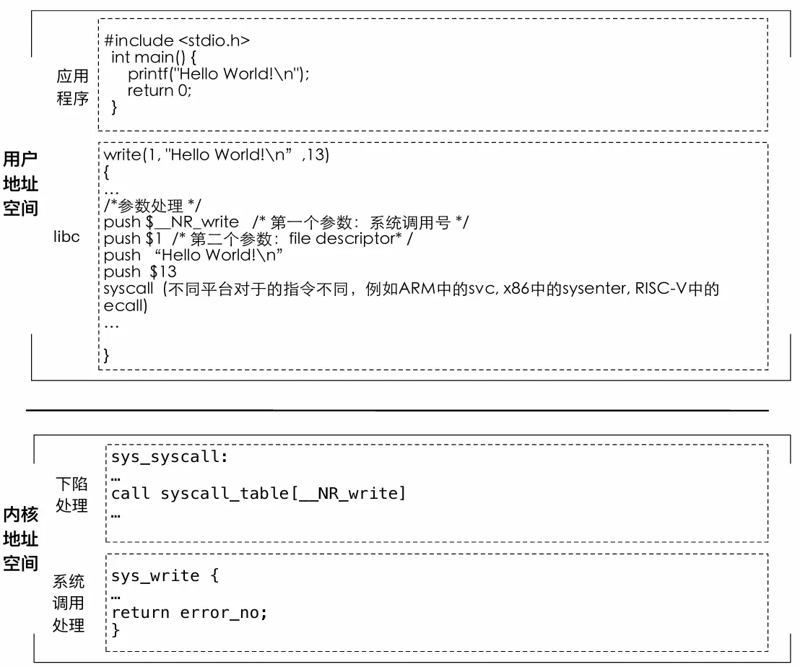

## 什么是操作系统  
 "操作系统是管理硬件资源、控制程序运行、改善人机界面和为应用软件提供支持的一种系统软件。"  

**操作系统考虑的一些问题**

• hello 这个可执行文件存储在什么位置？是如何存储的？

• hello 这个可执行文件是如何加载到CPU 中运行？

• hello 这个可执行文件是如何将"Hello World!"这行字输出到屏幕？

• 两个hello 程序同时运行的过程中如何在一个CPU 中运行？

**操作系统为应用提供的一些服务**

• 为应用提供计算资源的抽象
– CPU：进程/线程，数量不受物理CPU的限制
– 内存：虚拟内存，大小不受物理内存的限制
– I/O设备：将各种设备统一抽象为文件，提供统一接口

• 为应用提供线程间的同步– 应用可以实现自己的同步原语（如spinlock）
– 操作系统提供了更高效的同步原语（与线程切换配合, 如pthread_mutex）

• 为应用提供进程间的通信– 应用可以利用网络进行进程间通信（如loopback设备）
– 操作系统提供了更高效的本地通信机制（具有更丰富的语义，如pipe）

 • 例：Shell Pipe

**操作系统对应用的管理**

• 生命周期的管理

– 应用的加载、迁移、销毁等操作

• 计算资源的分配

– CPU：线程的调度机制

– 内存：物理内存的分配

– I/O设备：设备的复用与分配

• 安全与隔离

– 应用程序内部：访问控制机制

– 应用程序之间：隔离机制，包括错误隔离和性能隔离

**问题**

• 问题一：如果一台机器有且只有一个应用程序，开机 后自动运行且不会退出，是否还需要操作系统？ 

• 问题二：如果一个应用希望自己完全控制硬件而不是 使用操作系统提供的抽象，是否还需要操作系统？  

**操作系统=管理+服务**

• 管理和服务的目标有可能存在冲突

– 服务的目标：单个应用的运行效率最大化

– 管理的目标：系统的资源整体利用率最大化

– 例：单纯强调公平性的调度策略往往资源利用率低 

&emsp;&emsp;• 如细粒度的round-robin导致大量的上下文切换  

**操作系统的定义**

• 操作系统的核心功能：– 将有限的、离散的资源，高效地抽象为无限的、连续的资源

• 从软件角度的定义：– 硬件资源虚拟化+管理功能可编程

• 从结构角度的定义：– 操作系统内核+系统框架

**应用与操作系统的交互：系统调用**  

 什么是系统调用？– 应用调用操作系统的机制，实现应用不能实现的功能  

 例如：printf() -> write()->sys_write()– write(1, "Hello World!\n", 13）

 使应用调用操作系统的功能就像普通函数调用一样  

**Hello运行中的系统调用（strace）** 

 /* 运行hello程序 */  

 `execve("./hello", ["./hello"], 0x7ffed5a79e80 /* 64 vars */) = 0  `

 ...  

 /*将``Hello World!\n''写到标准输出中，在这里，1代表标准输出， 13代表一共写了13个字符。*/  

 `write(1, "Hello World!\n", 13Hello World!) = 13  `

 /* 执行结束后，hello程序退出*/  

 `exit_group(0)  `

**系统调用过程**



**操作系统的功能：管理**

 • 避免一个流氓应用独占所有资源  

 • 方法-1：每10ms发生一个时钟中断（时间片）   – 调度器决定下一个要运行的任务  

 • 方法-2：可通过信号等打断当前任务执行   – 如：kill -9 1951  

```cpp
int main(){
    while (1);
}
```

 • 如何卡死一个OS?   – 例：rogue-1.c 可以fork出无数的进程  

```cpp
int main(){
    while (1)
        fork();
}
```

 • 如何解决这个问题？  

 – 资源配额：cgroup/Linux  

 – 虚拟化：虚拟机  

 – 万能方法：重启机器  

 – 制度约束：AppStore的程序预审准入机制  

##  为什么学习操作系统  
 • 操作系统是一个成熟的领域

– Windows曾经一统天下数十年

– 让用户改变操作系统是很困难的

– 我们是否需要新的操作系统  

 • "新的"操作系统不断出现

– Linux、Mac OS、Android、iOS、ROS...

– 大疆用什么操作系统？谷歌数据中心用什么操作系统？ 

火星车用什么操作系统？..  

 • 操作系统是系统领域的基石  

 • 系统领域有大量的公司  

 – 微软、谷歌、IBM、EMC、VMware、华为、阿里...  

 – 谷歌的核心技术  

&emsp;&emsp;• 集群、GFS、MapReduce、BigTable  

&emsp;&emsp;• 都是系统领域的优秀工作  

 • 学好操作系统，forfunandprofit  

 – 优秀的公司，优秀的大学，更多的机会  

**这门课程希望带给大家的能力**  

 • 成为一个更高效的程序员

– 更快找到并消灭bug的能力

– 理解并调试程序性能的能力  

 • 理解复杂系统设计与实现的能力  

 • 构建一个操作系统的能力  

**课程的特点：抽象与具体**

 • 许多课程强调抽象

– 如：抽象数据类型、渐进分析等  

 • 这些抽象通常不可避免的带来限制  

 – 尤其是当bug存在的时候  

 – 需要理解底层的实现细节，才能突破限制  

**为什么操作系统比较难/有意思？**  

 • 深入事情本质：直接管理硬件细节  

 – 好处：实现资源的高效利用，从根本上解决问题，做一个高效程序员（降维）  

 – 挑战：需要理解与处理硬件细节，硬件甚至可能出错  

 – “把复杂留给自己、把简单留给用户”  

 &emsp;&emsp;• 对比：用户态写一个Hello World和在操作系统内核中输出一个Hello World (Lab1)  

 • 锻炼系统架构能力

– 将复杂问题进行抽象与化简

– 最好的体现了M.A.L.H原则的使用

– 计算机科学中30%的原则是从操作系统中来的(13/41, greatprinciples .org)  

 • 各种问题的交互与相互影响

– fd = open (); … ; fork();  

**操作系统的机遇和挑战**  

 • 新的硬件层出不穷

– 硬件种类越来越多：如自动驾驶、无人机、各种IoT设备等

– 硬件互联越来越复杂：如AirDrop、摄像头和驾驶系统  

 • 应用需求日新月异

– 对时延的要求越来越苛刻，如自动驾驶系统

– 对资源利用率要求越来越高，如数据中心混部  

 • 新的硬件和应用呼唤新的抽象和管理——新的操作系统 
